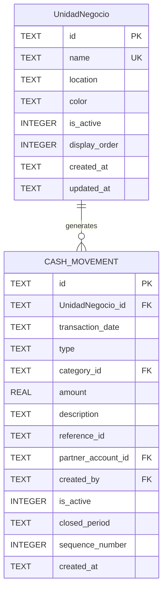

# Movimientos de Caja por Business Unit (Unidad de Negocio)

## Propósito
Gestionar los movimientos de caja (débitos y créditos) específicos de cada **Business Unit** (unidad de negocio) en Supabase PostgreSQL, proporcionando:
- Registro detallado de ingresos (CR) y egresos (DB) por local
- Cálculo automático del saldo de caja (suma de ingresos - suma de egresos)
- Paginación y ordenamiento descendente de movimientos
- Control de estados activo/inactivo para cierres contables
- Edición limitada (solo último movimiento activo)
- Integración con el dashboard principal (Estado de Caja)
- Sincronización en tiempo real a través de Supabase

## Migración a Supabase (Febrero 2026)
Esta funcionalidad ha sido migrada de SQLite a **Supabase PostgreSQL**. Cambios principales:
- **Tabla:** `cash_movements` con campo `business_unit_id` (antes `UnidadNegocio_id`)
- **Repository:** `cashMovementRepository.js` utiliza cliente Supabase
- **Índices:** Optimizados para PostgreSQL con real-time capabilities
- **Validaciones:** Lógica de negocio mantenida en capa de servicio

## Arquitectura y Cambios Requeridos

### Modificaciones al Esquema de Base de Datos

**Tabla `cash_movements` - Nuevos campos requeridos:**

| Columna | Tipo | Restricciones | Descripción |
|---------|------|---------------|-------------|
| UnidadNegocio_id | TEXT | FOREIGN KEY REFERENCES UnidadNegocio(id) | "Unidad de Negocio" asociado al movimiento |
| is_active | INTEGER | DEFAULT 1, CHECK (0,1) | 1=activo (visible), 0=inactivo (histórico) |
| closed_period | TEXT | | Período de cierre (ej: "2025-S2" para semestre) |
| sequence_number | INTEGER | | Número secuencial único por "Unidad de Negocio" |

**Índices adicionales:**
- `idx_cash_movements_UnidadNegocio_active` (UnidadNegocio_id, is_active)
- `idx_cash_movements_sequence` (UnidadNegocio_id, sequence_number DESC)

### Relaciones Actualizadas



## Flujo de Trabajo

### 1. Registro de Nuevos Movimientos
**Permisos:** Socio Gerente y Socios (según configuración)
**Restricciones:**
- Solo se puede crear movimientos para "Unidad de Negocio" activos
- Cada movimiento recibe un `sequence_number` autoincremental por "Unidad de Negocio"
- Por defecto `is_active = 1` (visible en sistema)
- Campos obligatorios: "Unidad de Negocio", tipo (CREDIT/DEBIT), categoría, monto, fecha

### 2. Estado Activo/Inactivo
**Movimientos Activos (`is_active = 1`):**
- Visibles en todas las pantallas del sistema
- Contribuyen al cálculo del saldo de caja
- Aparecen en reportes y dashboard
- Último movimiento activo es editable (descripción únicamente)

**Movimientos Inactivos (`is_active = 0`):**
- No visibles en interfaces regulares
- Excluidos del saldo de caja actual
- Conservados como histórico contable
- Solo accesibles mediante funciones especiales de administración
- Marcados con `closed_period` indicando período de cierre (anual/semestral)

### 3. Cálculo del Saldo de Caja
**Fórmula:** `Saldo = Σ(CREDIT activos) - Σ(DEBIT activos)`
**Implementación:**
```sql
SELECT 
  COALESCE(SUM(CASE WHEN type = 'CREDIT' THEN amount ELSE 0 END), 0) as total_credits,
  COALESCE(SUM(CASE WHEN type = 'DEBIT' THEN amount ELSE 0 END), 0) as total_debits,
  COALESCE(SUM(CASE WHEN type = 'CREDIT' THEN amount ELSE -amount END), 0) as current_balance
FROM cash_movements 
WHERE UnidadNegocio_id = ? AND is_active = 1
```

**Integración con Dashboard:**
- El valor "Estado de caja" en el dashboard es la suma de saldos de todos los "Unidad de Negocio"s
- Se actualiza en tiempo real con cada movimiento activo

### 4. Paginación y Ordenamiento
**Orden por defecto:** `transaction_date DESC, sequence_number DESC`
**Paginación:**
- Límite configurable (ej: 50 movimientos por página)
- Scroll infinito o paginación numérica
- Filtros preservados entre páginas

**Consulta paginada:**
```sql
SELECT cm.*, mc.code as category_code, mc.name as category_name, r.name as UnidadNegocio_name
FROM cash_movements cm
JOIN movement_categories mc ON cm.category_id = mc.id
JOIN UnidadNegocios r ON cm.UnidadNegocio_id = r.id
WHERE cm.is_active = 1 AND cm.UnidadNegocio_id = ?
ORDER BY cm.transaction_date DESC, cm.sequence_number DESC
LIMIT ? OFFSET ?
```

### 5. Reglas de Edición y Eliminación

**Último Movimiento Activo:**
- Definición: Mayor `sequence_number` con `is_active = 1` por "Unidad de Negocio"
- Permitido: Editar descripción (otros campos bloqueados)
- Prohibido: Eliminar, cambiar monto, tipo, categoría o fecha

**Movimientos No Editables:**
- Todos excepto el último activo
- Movimientos inactivos (históricos)
- Movimientos con `closed_period` no nulo

**Eliminación:**
- No permitida para movimientos individuales
- Movimientos inactivos solo eliminables mediante función de administración
- Función "Purga histórica" accesible desde Configuración (Socio Gerente)

## Interfaz de Usuario

### Pantalla Principal de Movimientos
**Estructura:**
1. **Selector de "Unidad de Negocio":** Dropdown con todos los "Unidad de Negocio"s activos
2. **Resumen de Saldo:** Tarjeta con total ingresos, egresos y saldo actual
3. **Lista de Movimientos:** Tabla paginada con columnas:
   - Fecha/Hora
   - Tipo (CREDIT/DEBIT con colores)
   - Categoría
   - Descripción
   - Monto (color según tipo)
   - Acciones (editar solo si es último activo)

4. **Controles:**
   - Botón "CREATE" para nuevo movimiento (redirige a pantalla de carga)
   - Filtros por fecha, categoría, tipo
   - Selector de página/tamaño de página

### Estados Visuales
**Movimiento Activo (normal):** Fondo blanco, texto estándar
**Último Movimiento Activo (editable):** Borde azul, ícono de edición habilitado
**Movimiento Inactivo (histórico):** No visible en esta pantalla
**Movimiento de Cierre:** No visible (filtrado por `is_active = 0`)

### Modal de Edición
**Acceso:** Click en ícono de edición del último movimiento activo
**Campos editables:**
- Descripción (texto multilínea)
- Referencia ID (opcional)
**Campos de solo lectura (informativos):**
- Fecha, Tipo, Categoría, Monto, "Unidad de Negocio"
**Botones:** Guardar (✅), Cancelar (❌)

### Pantalla de Carga (CREATE)
**Acceso:** Botón "CREATE" o navegación desde DataEntryScreen existente
**Campos requeridos:**
- "Unidad de Negocio" (selector)
- Tipo (CREDIT/DEBIT) - derivado de categoría
- Categoría (selector basado en "Unidad de Negocio"/tipo)
- Monto (validación > 0)
- Fecha (por defecto hoy, editable)
- Descripción (opcional)
**Validaciones:**
- Monto positivo
- Categoría compatible con tipo
- "Unidad de Negocio" activo

## Integración con Módulos Existentes

### CashMovementScreen Actual
**Archivo:** `src/presentation/screens/CashMovementScreen.js`
**Modificaciones requeridas:**
1. Agregar selector de "Unidad de Negocio" en header
2. Filtrar movimientos por `UnidadNegocio_id` seleccionado
3. Actualizar consultas para incluir `is_active = 1`
4. Implementar lógica de "último movimiento editable"
5. Agregar paginación con `LIMIT/OFFSET`

### Servicios y Repositorios
**`cashMovementRepository.js` - Nuevas funciones:**
- `getCashMovementsByUnidadNegocio(UnidadNegocioId, limit, offset)`
- `getLastActiveMovement(UnidadNegocioId)`
- `getUnidadNegocioBalance(UnidadNegocioId)`
- `deactivateMovementsForPeriod(UnidadNegocioId, period)`

**`cashAccountService.js` - Actualizaciones:**
- Validar que nuevo movimiento sea para "Unidad de Negocio" activo
- Asignar `sequence_number` automático
- Implementar reglas de edición (solo último activo)

### Dashboard Integration
**DashboardScreen:** `getCashBalance()` debe sumar saldos de todos los "Unidad de Negocio"s
**Fórmula actualizada:**
```javascript
const totalBalance = UnidadNegocios.reduce((sum, UnidadNegocio) => {
  return sum + getUnidadNegocioBalance(UnidadNegocio.id);
}, 0);
```

## Proceso de Cierre Contable

### Cierre Semestral/Anual
**Trigger:** Acción manual del Socio Gerente
**Pasos:**
1. Seleccionar período (ej: "2025-S1" para primer semestre 2025)
2. Seleccionar "Unidad de Negocio"(s)
3. Confirmación con resumen de movimientos a cerrar
4. Ejecución:
   - Actualizar `is_active = 0` para movimientos seleccionados
   - Asignar `closed_period` con identificador de período
   - Generar movimiento de cierre (CREDIT especial) con resumen
5. Resultado: Movimientos desaparecen de vistas regulares, saldo se recalcula

### Recuperación de Históricos
**Acceso:** Configuración → Administración → Históricos
**Funcionalidad:**
- Listar movimientos inactivos por período
- Exportar a CSV/Excel
- Opción de "purga" (eliminación permanente con confirmación)

## Consideraciones de Seguridad

### Permisos por Rol
**Socio Gerente:**
- Crear movimientos en cualquier "Unidad de Negocio"
- Editar último movimiento activo en cualquier "Unidad de Negocio"
- Ejecutar cierres contables
- Acceder a históricos y purgas

**Socio Regular:**
- Crear movimientos solo en "Unidad de Negocio" asignados
- Editar último movimiento activo en sus "Unidad de Negocio"s
- Ver solo movimientos activos de sus "Unidad de Negocio"s

**Restricciones transversales:**
- Nunca modificar montos, fechas, tipos o categorías de movimientos existentes
- Nunca eliminar movimientos individuales
- Validación de consistencia en cada operación

### Integridad de Datos
**Restricciones de base de datos:**
- `FOREIGN KEY (UnidadNegocio_id) REFERENCES UnidadNegocios(id)`
- `CHECK (is_active IN (0, 1))`
- `UNIQUE (UnidadNegocio_id, sequence_number)` para garantizar secuencia

**Validaciones de aplicación:**
- No permitir cierres con movimientos futuros
- Verificar consistencia de saldos antes/después de operaciones
- Log de auditoría para cambios críticos

## Migración de Datos Existentes

### Movimientos Actuales (`cash_movements`)
**Asignación por defecto:**
- `UnidadNegocio_id`: Asignar al "Unidad de Negocio" principal o requerir migración manual
- `is_active`: 1 (todos activos inicialmente)
- `sequence_number`: Generar secuencia basada en `created_at`

**Script de migración:**
```sql
-- 1. Agregar columnas (si no existen)
ALTER TABLE cash_movements ADD COLUMN UnidadNegocio_id TEXT REFERENCES UnidadNegocios(id);
ALTER TABLE cash_movements ADD COLUMN is_active INTEGER DEFAULT 1 CHECK (is_active IN (0, 1));
ALTER TABLE cash_movements ADD COLUMN closed_period TEXT;
ALTER TABLE cash_movements ADD COLUMN sequence_number INTEGER;

-- 2. Asignar "Unidad de Negocio" principal a movimientos existentes
UPDATE cash_movements SET UnidadNegocio_id = (SELECT id FROM UnidadNegocios WHERE name LIKE '%Centro%' LIMIT 1);

-- 3. Generar secuencia por "Unidad de Negocio" y fecha
WITH numbered AS (
  SELECT id, UnidadNegocio_id, created_at,
         ROW_NUMBER() OVER (PARTITION BY UnidadNegocio_id ORDER BY created_at) as seq
  FROM cash_movements
  WHERE UnidadNegocio_id IS NOT NULL
)
UPDATE cash_movements 
SET sequence_number = numbered.seq
FROM numbered 
WHERE cash_movements.id = numbered.id;

-- 4. Crear índices
CREATE INDEX idx_cash_movements_UnidadNegocio_active ON cash_movements(UnidadNegocio_id, is_active);
CREATE INDEX idx_cash_movements_sequence ON cash_movements(UnidadNegocio_id, sequence_number DESC);
```

## Pruebas y Validación

### Casos de Prueba Críticos
1. **Creación de movimiento:** Verificar asignación correcta de `sequence_number`
2. **Edición de último movimiento:** Solo descripción editable
3. **Cálculo de saldo:** Excluir movimientos inactivos
4. **Cierre contable:** Movimientos cambian a inactivo, saldo se ajusta
5. **Paginación:** Mantener orden y filtros entre páginas
6. **Permisos:** Restricciones por rol y "Unidad de Negocio"

### Validación de Integridad
**Antes de cada release:**
- Verificar que `Σ(saldos por "Unidad de Negocio") = saldo total del dashboard`
- Confirmar que no hay huecos en `sequence_number` por "Unidad de Negocio"
- Validar que movimientos inactivos no aparecen en consultas regulares
- Probar rollback en caso de error durante cierre contable

## Mantenimiento y Monitoreo

### Métricas de Salud
- **Conteo de movimientos activos** por "Unidad de Negocio"
- **Secuencia máxima** por "Unidad de Negocio" (detectar anomalías)
- **Saldo vs movimientos** (validación de consistencia)
- **Movimientos sin "Unidad de Negocio"** (deben ser 0 después de migración)

### Tareas Programadas
**Diario:** Validación de integridad de secuencias
**Semanal:** Backup de movimientos inactivos (exportación)
**Mensual:** Reporte de saldos por "Unidad de Negocio"

### Resolución de Problemas
**Secuencia duplicada:** Reasignar números secuenciales
**Movimiento huérfano:** Asignar "Unidad de Negocio" o marcar como excepción
**Saldo inconsistente:** Recalcular desde último cierre conocido

---

*Última actualización: Febrero 2026*  
*Responsable: Equipo de Desarrollo Flash Report*
