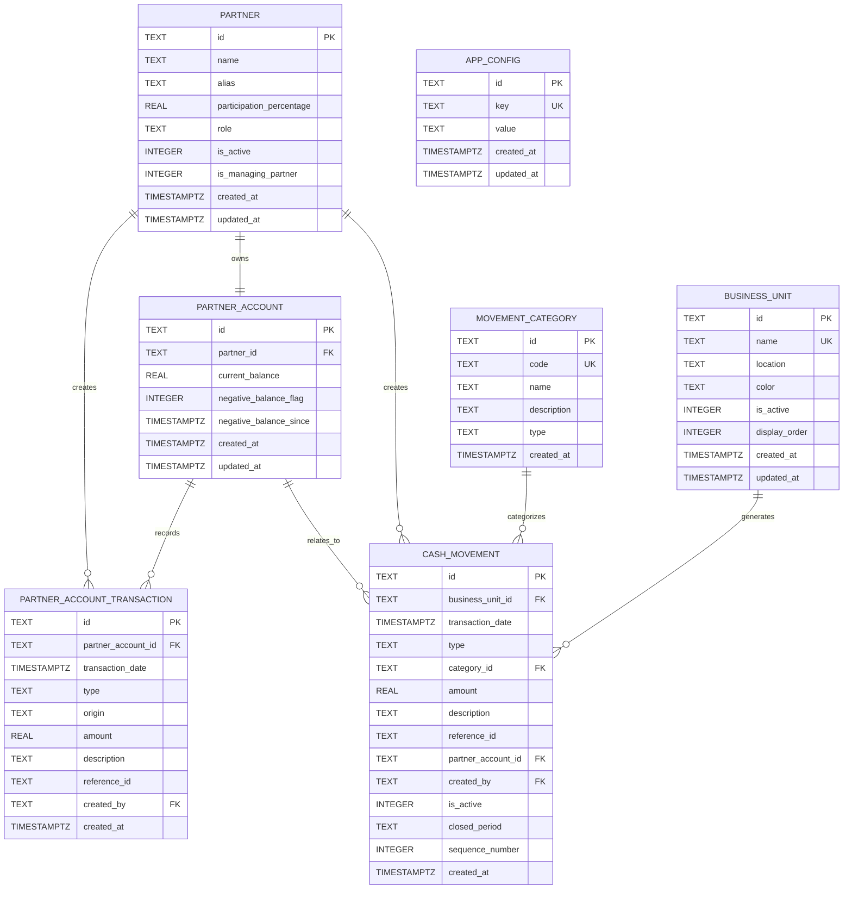

# Diseño de Base de Datos (Flash Report - Supabase PostgreSQL)

## Propósito
Gestionar datos financieros de cadena de restaurantes, socios, transacciones y cierres de caja en **Supabase PostgreSQL** (cloud, real-time capabilities). Soporta:
- Registro de socios y cuentas corrientes con sistema de socio gerente
- Movimientos de caja con doble entrada por unidad de negocio
- Cierres de caja diarios por restaurante con secuencia automática
- Distribución de utilidades y balances negativos con compensación automática
- Sincronización en tiempo real entre dispositivos
- Histórico completo con soft-delete y períodos de cierre

## Migración desde SQLite (Febrero 2026)
Este proyecto ha migrado de SQLite local a **Supabase PostgreSQL** para habilitar sincronización en tiempo real, escalabilidad y acceso multi-plataforma. Los cambios principales incluyen:
- **Esquema compatible:** Mismas tablas y relaciones con tipos de datos PostgreSQL
- **Repository Pattern:** Capa de abstracción que utiliza `supabase-js` cliente
- **Autenticación:** Soporte para autenticación de Supabase (futuro)
- **Real-time:** Suscripciones a cambios en tiempo real (en desarrollo)

**Nota:** Las secciones sobre datos de prueba (`seed.js`, `seedSales.js`) aún hacen referencia a la implementación SQLite original, pero la lógica de seed ha sido adaptada para Supabase.

## Esquema de Base de Datos

### Tablas Principales (Supabase PostgreSQL)

#### `partners` - Socios del sistema
| Columna | Tipo | Restricciones | Descripción |
|---------|------|---------------|-------------|
| id | TEXT | PRIMARY KEY | Identificador único (UUID) |
| name | TEXT | NOT NULL | Nombre completo del socio |
| alias | TEXT | | Alias o abreviatura |
| participation_percentage | REAL | NOT NULL | Porcentaje de participación (0-100) |
| role | TEXT | NOT NULL | Rol: "Managing Partner", "Partner" |
| is_active | INTEGER | DEFAULT 1 | 1=activo, 0=inactivo |
| is_managing_partner | INTEGER | DEFAULT 0 | 1=socio gerente (solo uno activo) |
| created_at | TIMESTAMPTZ | DEFAULT NOW() | Fecha creación |
| updated_at | TIMESTAMPTZ | DEFAULT NOW() | Fecha actualización |

#### `partner_accounts` - Cuentas corrientes de socios
| Columna | Tipo | Restricciones | Descripción |
|---------|------|---------------|-------------|
| id | TEXT | PRIMARY KEY | Identificador único |
| partner_id | TEXT | NOT NULL, FOREIGN KEY REFERENCES partners(id) | Socio dueño de la cuenta |
| current_balance | REAL | DEFAULT 0 | Saldo actual (puede ser negativo) |
| negative_balance_flag | INTEGER | CHECK (negative_balance_flag IN (0,1)) DEFAULT 0 | 1=saldo negativo pendiente |
| negative_balance_since | TIMESTAMPTZ | | Fecha desde que está en negativo |
| created_at | TIMESTAMPTZ | DEFAULT NOW() | |
| updated_at | TIMESTAMPTZ | DEFAULT NOW() | |

#### `partner_account_transactions` - Transacciones de cuentas
| Columna | Tipo | Restricciones | Descripción |
|---------|------|---------------|-------------|
| id | TEXT | PRIMARY KEY | Identificador único |
| partner_account_id | TEXT | NOT NULL, FOREIGN KEY REFERENCES partner_accounts(id) | Cuenta afectada |
| transaction_date | TIMESTAMPTZ | NOT NULL | Fecha de la transacción |
| type | TEXT | CHECK (type IN ('DB','CR')) | Débito (DB) o crédito (CR) |
| origin | TEXT | CHECK (origin IN ('WITHDRAWAL','DISTRIBUTION','SETTLEMENT_PAYMENT','EXPENSE_REIMBURSEMENT','ADJUSTMENT')) | Origen de la transacción |
| amount | REAL | NOT NULL | Monto absoluto |
| description | TEXT | | Descripción opcional |
| reference_id | TEXT | | ID de referencia externa |
| created_by | TEXT | FOREIGN KEY REFERENCES partners(id) | Socio que creó la transacción |
| created_at | TIMESTAMPTZ | DEFAULT NOW() | |

#### `business_units` - Unidades de negocio (Restaurantes/Sucursales)
| Columna | Tipo | Restricciones | Descripción |
|---------|------|---------------|-------------|
| id | TEXT | PRIMARY KEY | Identificador único |
| name | TEXT | NOT NULL UNIQUE | Nombre de la unidad de negocio |
| location | TEXT | | Ubicación física |
| color | TEXT | NOT NULL | Color hexadecimal (#FF5733) para UI |
| is_active | INTEGER | DEFAULT 1 | 1=activo, 0=cerrado |
| display_order | INTEGER | DEFAULT 0 | Orden de visualización en dropdowns |
| created_at | TIMESTAMPTZ | DEFAULT NOW() | |
| updated_at | TIMESTAMPTZ | DEFAULT NOW() | |

#### `movement_categories` - Categorías de movimientos de caja
| Columna | Tipo | Restricciones | Descripción |
|---------|------|---------------|-------------|
| id | TEXT | PRIMARY KEY | Identificador único |
| code | TEXT | NOT NULL UNIQUE | Código interno (ej: CIERRE_CAJA) |
| name | TEXT | NOT NULL | Nombre legible |
| description | TEXT | | Descripción opcional |
| type | TEXT | CHECK (type IN ('CR','DB','BOTH')) | Tipo de movimiento permitido |
| created_at | TIMESTAMPTZ | DEFAULT NOW() | |

#### `cash_movements` - Movimientos de caja (sistema de doble entrada)
| Columna | Tipo | Restricciones | Descripción |
|---------|------|---------------|-------------|
| id | TEXT | PRIMARY KEY | Identificador único |
| business_unit_id | TEXT | NOT NULL, FOREIGN KEY REFERENCES business_units(id) | Unidad de negocio asociada |
| transaction_date | TIMESTAMPTZ | NOT NULL | Fecha del movimiento |
| type | TEXT | CHECK (type IN ('CR','DB')) | Tipo: crédito (CR) o débito (DB) |
| category_id | TEXT | NOT NULL, FOREIGN KEY REFERENCES movement_categories(id) | Categoría del movimiento |
| amount | REAL | NOT NULL | Monto |
| description | TEXT | | Descripción detallada |
| reference_id | TEXT | | ID de referencia externa |
| partner_account_id | TEXT | FOREIGN KEY REFERENCES partner_accounts(id) | Socio relacionado (opcional) |
| created_by | TEXT | FOREIGN KEY REFERENCES partners(id) | Socio que registró el movimiento |
| is_active | INTEGER | DEFAULT 1 CHECK (is_active IN (0, 1)) | 1=activo (visible), 0=inactivo (histórico) |
| closed_period | TEXT | | Período de cierre contable (ej: "2026-S1") |
| sequence_number | INTEGER | | Número secuencial único por unidad de negocio |
| created_at | TIMESTAMPTZ | DEFAULT NOW() | |

#### `app_config` - Configuración de la aplicación
| Columna | Tipo | Restricciones | Descripción |
|---------|------|---------------|-------------|
| id | TEXT | PRIMARY KEY | Identificador único |
| key | TEXT | NOT NULL UNIQUE | Clave de configuración |
| value | TEXT | NOT NULL | Valor de configuración |
| created_at | TIMESTAMPTZ | DEFAULT NOW() | |
| updated_at | TIMESTAMPTZ | DEFAULT NOW() | |

## Relaciones entre Entidades



## Claves Foráneas y Restricciones

### Foreign Keys
1. `partner_accounts.partner_id` → `partners.id`
2. `partner_account_transactions.partner_account_id` → `partner_accounts.id`
3. `partner_account_transactions.created_by` → `partners.id`
4. `cash_movements.business_unit_id` → `business_units.id`
5. `cash_movements.category_id` → `movement_categories.id`
6. `cash_movements.partner_account_id` → `partner_accounts.id`
7. `cash_movements.created_by` → `partners.id`

### CHECK Constraints (PostgreSQL)
- `partner_accounts.negative_balance_flag IN (0, 1)`
- `partner_account_transactions.type IN ('DB', 'CR')`
- `partner_account_transactions.origin IN ('WITHDRAWAL', 'DISTRIBUTION', 'SETTLEMENT_PAYMENT', 'EXPENSE_REIMBURSEMENT', 'ADJUSTMENT')`
- `movement_categories.type IN ('CR', 'DB', 'BOTH')`
- `cash_movements.type IN ('CR', 'DB')`
- `cash_movements.is_active IN (0, 1)`
- `partners.is_managing_partner IN (0, 1)`
- `business_units.is_active IN (0, 1)`

### Unique Constraints
- `business_units.name UNIQUE`
- `movement_categories.code UNIQUE`
- `app_config.key UNIQUE`
- `partners.is_managing_partner` (restricción de aplicación: solo un socio gerente activo)

## Índices

| Tabla | Índice | Columnas | Propósito |
|-------|--------|----------|-----------|
| partner_accounts | idx_partner_accounts_partner_id | partner_id | Búsqueda rápida de cuentas por socio |
| partner_account_transactions | idx_partner_account_transactions_account_id | partner_account_id | Historial de transacciones |
| partner_account_transactions | idx_partner_account_transactions_created_at | created_at | Ordenamiento por fecha |
| business_units | idx_business_units_active | is_active | Filtrado por estado |
| business_units | idx_business_units_order | display_order | Ordenamiento en UI |
| cash_movements | idx_cash_movements_bu_active | business_unit_id, is_active | Filtrado rápido por unidad de negocio activa |
| cash_movements | idx_cash_movements_sequence | business_unit_id, sequence_number DESC | Obtención del último movimiento |
| cash_movements | idx_cash_movements_date | transaction_date | Reportes por fecha |
| cash_movements | idx_cash_movements_category | category_id | Filtrado por categoría |
| cash_movements | idx_cash_movements_partner | partner_account_id | Movimientos por socio |

## Triggers

En PostgreSQL se podrían implementar triggers para garantizar integridad (ej: solo un socio gerente activo), pero actualmente la lógica de negocio se maneja en la capa de aplicación (TypeScript/JavaScript) para:
- Mantener portabilidad entre plataformas (iOS, Android, Web)
- Facilitar testing y debugging
- Centralizar reglas de negocio en servicios de dominio
- Evitar dependencias específicas del motor de base de datos

Las operaciones atómicas y consistencia se garantizan mediante transacciones explícitas en los servicios de dominio y validaciones a nivel de aplicación.

## Datos de Prueba (Seed Data)

### Seed Básico (`src/infrastructure/db/seed.js`)
**Propósito:** Inicializar datos mínimos para funcionamiento básico.

**Contenido:**
1. **3 Socios:**
   - Juan Pérez (40%, Socio Gerente) - Saldo inicial: $1,500 ARS
   - María García (35%, Socio) - Saldo inicial: -$500 ARS (negativo)
   - Carlos López (25%, Socio) - Saldo inicial: $200 ARS

2. **5 Categorías de Movimiento:**
   - CIERRE_CAJA (CREDIT) - Ingreso por cierre de caja diario
   - OTRO_INGRESO (CREDIT) - Otros ingresos no operativos
   - GASTO (DEBIT) - Gastos operativos y administrativos
   - RETIRO_SOCIO (DEBIT) - Retiro de efectivo por socio
   - DISTRIBUCION (DEBIT) - Distribución de utilidades a socios

3. **Cuentas y Transacción Ejemplo:**
   - Transacción de débito para el saldo negativo de María García (origen: WITHDRAWAL)

**Activación:** Se ejecuta automáticamente al iniciar la aplicación (`App.js:21-22`).

### Seed de Ventas Simuladas (`src/infrastructure/db/seedSales.js`)
**Propósito:** Generar datos realistas para testing y demostración del dashboard.

**Características:**
- **Período:** Enero 1-31, 2026 (temporada alta vacacional)
- **Restaurantes:** 3 locales con diferentes multiplicadores:
  - Centro: multiplicador 1.2 (mayor venta)
  - Norte: multiplicador 1.0 (venta media)
  - Sur: multiplicador 0.8 (venta menor)
- **Rango de montos:** $3,000 - $500,000 ARS por transacción
- **Patrones realistas:**
  - Fines de semana: ventas 50% mayores
  - Día de Año Nuevo (1 de enero): ventas reducidas (30%)
  - Segunda quincena: pico vacacional (40% aumento)
- **Volumen:** ~900 transacciones totales (~10 por restaurante por día)

**Algoritmo de Generación:**
```javascript
// Para cada día (1-31)
//   Para cada restaurante
//     Generar 5-20 transacciones por día
//     Aplicar multiplicadores (día × restaurante)
//     Insertar como cash_movement tipo CREDIT, categoría CIERRE_CAJA
```

## Activación y Desactivación

### Cargar Datos de Prueba

**Función:** `seedSalesData(onProgress: (current: number, total: number) => void)`

**Botón:** "Cargar Datos de Prueba" en SettingsScreen → Gestión de Datos

**Flujo:**
1. Confirmación multiplataforma (web: `window.confirm`, móvil: `Alert.alert`)
2. Modal de progreso con barra (días generados / total)
3. Ejecución de `seedSalesData` con callback de progreso
4. Validación previa: verifica si ya existen datos para enero 2026
5. Si existen, retorna estadísticas sin regenerar
6. Al completar: alerta de éxito con resumen

**Código:** `SettingsScreen.js:139-257`

### Eliminar Datos de Prueba

**Función:** `clearSalesData()`

**Botón:** "Eliminar Datos de Prueba" en SettingsScreen → Gestión de Datos

**Acción:**
```sql
DELETE FROM cash_movements 
WHERE transaction_date LIKE '2026-01-%' 
  AND category_id IN (
    SELECT id FROM movement_categories WHERE code = 'CIERRE_CAJA'
  )
```

**Flujo:**
1. Confirmación destructiva con advertencia
2. Ejecución síncrona de `clearSalesData`
3. Feedback visual con `ActivityIndicator`
4. Alerta de éxito/error

**Código:** `SettingsScreen.js:259-314`

## Uso y Alcance

### Propósito de los Datos de Prueba

1. **Demo del Dashboard:**
   - Gráficos de ventas con datos realistas
   - KPIs calculados sobre volumen significativo
   - Filtrado por fechas y restaurantes

2. **Testing de Funcionalidades:**
   - Rendimiento con ~900 registros
   - Paginación y scrolling en listas
   - Cálculos agregados (sumas, promedios, tendencias)

3. **Validación de UI Responsive:**
   - Visualización en móviles y tablets
   - Gráficos adaptativos a diferentes densidades de datos

4. **Capacitación y Onboarding:**
   - Demo para nuevos usuarios
   - Explicación de flujos con datos de ejemplo

### Limitaciones y Consideraciones

1. **Temporalidad:**
   - Datos solo para enero 2026
   - No incluye otros años o meses

2. **Alcance Modular:**
   - Solo cubre módulo de ventas (CIERRE_CAJA)
   - No incluye datos de gastos, distribuciones o ajustes

3. **No Producción:**
   - No reemplaza datos reales
   - Propósito exclusivo de desarrollo/testing

4. **Rendimiento:**
   - Generación toma ~5-10 segundos (dependiendo del dispositivo)
   - Consumo de memoria durante generación

## Botones en Interfaz (SettingsScreen)

### "Cargar Datos de Prueba" (Ícono: Calendar)

**Ubicación:** SettingsScreen → Gestión de Datos

**Comportamiento:**
- **Estado normal:** "Generar ventas Enero 2026 (simulado)"
- **Durante carga:** "Cargando..." + `ActivityIndicator`
- **Confirmación:** Muestra detalles de lo que se generará
- **Progreso:** Modal con barra de progreso y contador de días
- **Completado:** Alerta con estadísticas generadas

**Lógica asociada:** `handleLoadTestData()` + `loadTestDataWithProgress()`

### "Eliminar Datos de Prueba" (Ícono: Trash2)

**Ubicación:** SettingsScreen → Gestión de Datos

**Comportamiento:**
- **Estado normal:** "Borrar ventas Enero 2026"
- **Durante eliminación:** "Eliminando..." + `ActivityIndicator`
- **Confirmación:** Advertencia de irreversibilidad
- **Completado:** Alerta de éxito

**Lógica asociada:** `handleDeleteTestData()`

### Integración con Otros Botones

1. **"Importar CSV 2025":** Datos reales de año anterior (complementario)
2. **"Exportar Respaldo":** Incluye datos de prueba en backups JSON/CSV
3. **"Plantilla CSV":** Formato para importar datos reales

## Consideraciones Técnicas

### Base de Datos SQLite (Expo)

**Ventajas:**
- Offline-first, funciona sin conexión
- Portabilidad entre iOS, Android y Web (via mock)
- Transacciones ACID

**Limitaciones:**
- No soporta triggers complejos
- Tipado dinámico (TEXT para fechas)
- Escalabilidad vertical limitada

### Mock para Web

**Propósito:** Permitir preview en navegadores sin SQLite

**Implementación:** `database.js` detecta `Platform.OS === 'web'`

**Comportamiento:**
- Tablas en memoria como arrays JavaScript
- Operaciones simuladas con logging
- Compatibilidad total con interface de seed

### Seed Modular y Reutilizable

**Diseño:**
- `seed.js`: Datos estructurales (socios, categorías)
- `seedSales.js`: Datos operacionales (ventas)
- Independencia: cada seed verifica existencia previa

**Testing:** `seedSales.test.js` con mocks de database

**Mantenimiento:** Fácil extensión para nuevos módulos

## Mantenimiento y Evolución

### Agregar Nuevos Datos de Prueba

1. Crear nueva función en `seedSales.js` o nuevo archivo
2. Seguir patrón de verificación de existencia
3. Incluir callback de progreso para UI
4. Agregar botón en SettingsScreen con confirmación
5. Probar con suite existente

### Modificar Esquema Existente

1. Actualizar `schema.js` y `init.sql`
2. Considerar migración de datos existentes
3. Actualizar seeds para nuevo esquema
4. Revisar dependencias en servicios

### Backup y Restauración

Los datos de prueba se incluyen en:
- Exportación completa (JSON)
- Exportación de movimientos de caja (CSV)
- Pueden restaurarse via importación CSV

---

*Última actualización: Febrero 2026*  
*Responsable: Equipo de Desarrollo Flash Report*
